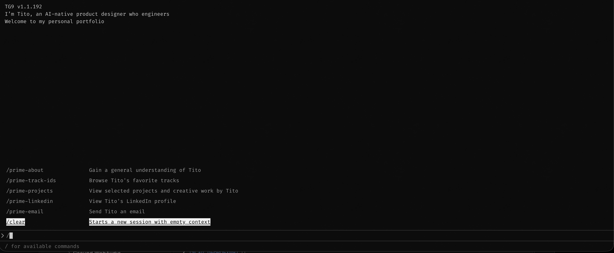
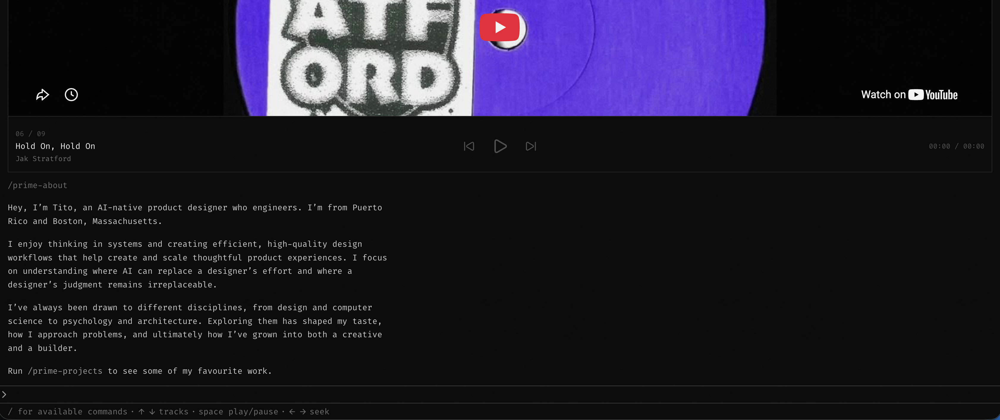
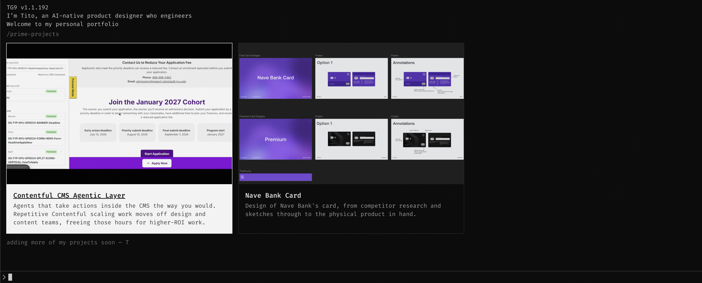
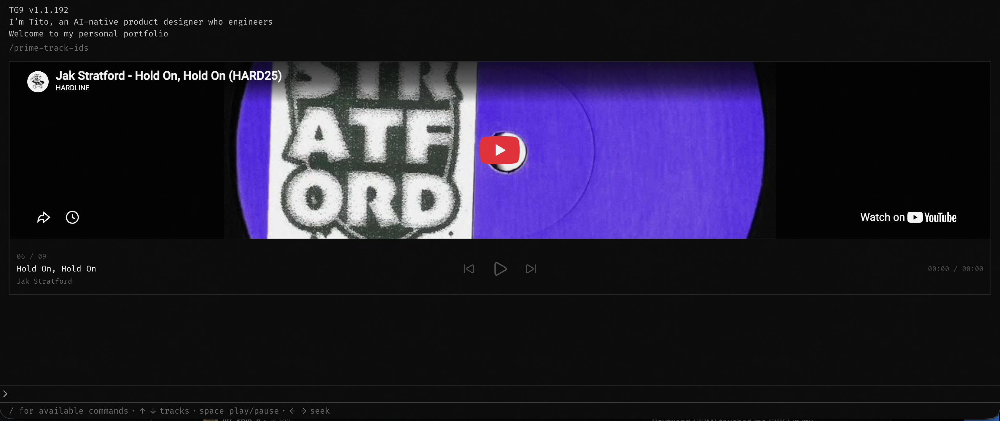

<div align="center">

# Tito Garcia's Portfolio

A terminal-style portfolio website for my product design work, live at **[titogarcia.dev](https://titogarcia.dev)**.

I had a lot of fun building it over a weekend, and I'll keep improving it over time.



</div>

---

## Features

- **Terminal navigation:** browse the site by typing slash commands such as `/prime-projects` and `/prime-about`.

  

- **Project cards:** case studies with video and image previews.

  

- **Track player:** a built-in music player with keyboard controls.

  

---

## Getting Started

> [!NOTE]
> Requires [Bun](https://bun.sh).

```bash
git clone https://github.com/titoggm/portfolio.git
cd portfolio
bun install
bun dev
```

Open [http://localhost:3000](http://localhost:3000) in your browser.
